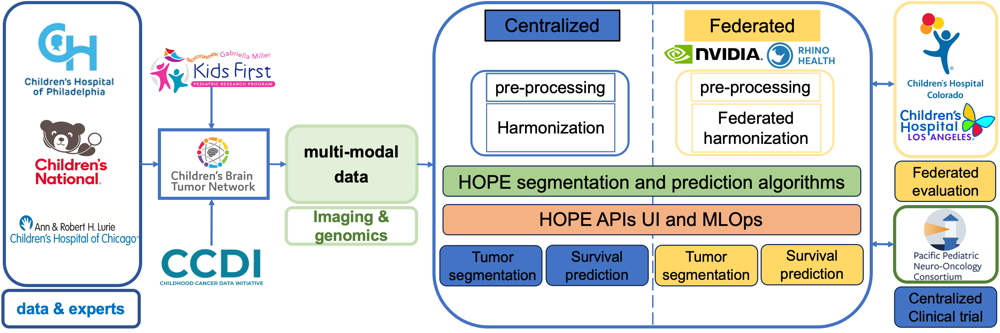

# Harnessing Artificial Intelligence for Optimized Pediatric Tumor Evaluation (HOPE)

Welcome to additional information on the HOPE platform. 

# HOPE Segmenter CBTN AWS Integration Diagram

<video width="620" controls>
  <source src="./assets/video/CBTN_Demo.mp4" type="video/mp4">
</video>

*CBTN AWS Integration Diagram: Right-click on the image to open in a new tab for a larger view.*

The implementation can be found on [GitHub](https://github.com/Precision-Medical-Imaging-Group/BraTS2024-PEDS).

 
The following workflow outlines a streamlined data pipeline to facilitate MRI image processing for predictive analysis. This process enables users to upload imaging data, which is then transferred, processed, and returned through a series of automated steps.

 

### 1. User Uploads MRI Data

 
The user accesses a secure web platform to upload NIFTI files, which contain MRI series data necessary for analysis.

 

### 2. File Transfer to S3 Proxy Bucket

 
The backend of the web application transfers the uploaded files to an Amazon S3 bucket. This S3 bucket acts as an intermediary storage solution, or “proxy location,” facilitating data flow between the web platform and the machine learning model. The backend polls a designated S3 folder within this bucket to retrieve prediction results, which will be generated later in the workflow (see Step 7).

 

### 3. Model Invocation via SageMaker Endpoint

 
The backend of the web application initiates the model by calling an Amazon SageMaker endpoint. This invocation includes the S3 location of the user’s files and the unique identifier of the model to be employed in the analysis.

 

### 4. Data Download to Model Input Directory

 
Upon invocation, a file downloader script embedded in the model’s entry point retrieves the user-uploaded files from the S3 bucket and saves them in a local `/input` directory for processing.

 

### 5. Model Processing

 
The BraTS model is triggered, producing segmentation results based on the uploaded MRI data. These outputs are stored in a local `/output` directory.

 

### 6. Uploading Results to S3 Proxy Bucket

 
The file uploader module then transfers the segmentation results from the `/output` directory back to the S3 proxy bucket, where they can be accessed by the web application backend.

 

### 7. Detection and Download of Prediction Results

 
The web application backend detects the presence of these prediction results in the S3 bucket and downloads them, making the processed data available to the end-user on the platform.

 

# HOPE Microservices Sequence Diagram

*HOPE Sequence Diagram: Right-click on the image to open in a new tab for a larger view.*

 
The diagram represents a sequence of interactions in a microservices-based MRI segmentation and processing system. Here’s a brief overview of each component and its role:

 

### User & Interactive Web App

 
The user uploads MRI files via a web application, initiating the segmentation process. The app then communicates with the backend services to track and retrieve processing statuses and results.

 

### API Gateway

 
Acts as an entry point for all backend requests. It coordinates the workflow by managing requests between the web app and the microservices, such as initiating preprocessing, running models, and fetching results.

 

### BraTS Preprocessor

 
 Prepares the MRI files for further analysis by fetching, processing, and uploading them. It performs initial processing steps to optimize the MRI data for harmonization and segmentation.

 

### HAIL Harmonizer

 
Enhances data consistency across different MRI formats and sources by applying harmonization techniques. It processes and uploads the harmonized data, preparing it for segmentation.

 

### HOPE Segmenter

 
The core segmentation model analyzes the harmonized MRI data to produce detailed segmentation results, which are essential for medical analysis.

 

### Database

 
Stores processed data and segmentation results, allowing the API gateway to fetch and display the final output for the user.

 
Each service communicates through the API Gateway, ensuring secure, modular, and efficient data flow across the entire processing pipeline. The user is notified at key steps, and the final segmentation results are available for download or viewing.

